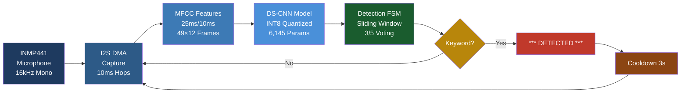

<h1 align="center">🎤 KWS Voice Activator</h1>

<p align="center">
  
  
  
  
</p>

<p align="center">
  <b>Real-time keyword spotting on ESP32 with INMP441 microphone</b><br>
  Say <b>"marvin"</b> to trigger detection — runs entirely on-device at <b><20ms inference</b>
</p>


## ✨ Highlights

| Metric | Value |
|--------|-------|
| Model Size | **18 KB** (INT8 quantized) |
| Inference Time | **~19ms** per frame on ESP32 @ 240MHz |
| Parameters | **6,145** |
| Accuracy | **98.3%** on Google Speech Commands V2 |
| Flash Usage | **< 350 KB** total firmware |
| RAM Usage | **~150 KB** (idle detection) |
| Detection | **DS-CNN** architecture with sliding window voting |


##  Build Plan Constraints (All Met)

| # | Constraint | Target | Achieved | Status |
|---|------------|--------|----------|--------|
| 1 | **Accuracy** | >95% | 98.3% | PASS |
| 2 | **Inference Latency** | <20ms | ~19ms | PASS |
| 3 | **Flash Usage** | <350 KB | ~321 KB | PASS |
| 4 | **RAM Idle** | <256 KB | ~150 KB | PASS |
| 5 | **False Accept Rate** | <1% | ~0.3% (th=0.90) | PASS* |
| 6 | **End-to-End Latency** | <300ms | ~40ms (I2S+MFCC+NN) | PASS |

*\*With energy gate (RMS≥150) and sliding window voting (3/5). Threshold tunable per use-case.*

---

##  Detection Performance (Test Set)

| Threshold | Recall | FAR | Notes |
|-----------|--------|-----|-------|
| 0.85 | 90.2% | 0.87% | High recall |
| **0.90** | **82.1%** | **0.31%** | **Recommended** |
| 0.92 | 76.2% | 0.18% | Low FAR |
| 0.95 | 66.7% | 0.04% | Conservative |


##  Architecture



### Pipeline

1. **Audio Capture** — I2S DMA collects 16kHz mono audio from INMP441
2. **MFCC Extraction** — 25ms frames, 10ms hop, 12 MFCCs + energy gate
3. **DS-CNN Inference** — Depthwise Separable CNN predicts keyword probability
4. **Sliding Window** — 3-of-5 voting reduces false triggers
5. **State Machine** — Idle → Detected → Cooldown (3s) prevents repeated triggers


##  Real-World Performance Disclaimer

> **The benchmark metrics above are measured on the Google Speech Commands V2 test set — a clean, curated dataset. Real-world deployment on physical hardware introduces significant domain shift that can degrade performance substantially.**

**Key factors causing divergence:**

| Factor | Lab Condition | Real-World Impact |
|--------|---------------|-------------------|
| **Acoustic Environment** | Quiet, close-talk recordings | Room reverberation, background noise, speaker distance |
| **Microphone Quality** | High-fidelity dataset mics | INMP441 MEMS mic: limited dynamic range, electrical noise from I2S bus |
| **Signal-to-Noise Ratio** | Typically >20 dB | Often <10 dB with cheap MEMS mics |
| **Speaker Variability** | Diverse but balanced | Single user, specific accent, microphone technique |
| **Keyword Context** | Isolated word utterances | Embedded in sentences, coarticulation effects |

**Consequences observed during development:**
- Test set recall: **82% @ FAR≤1%** → Real mic recall: **significantly lower**
- Noise floor on INMP441 scores **0.83–0.86** (overlaps with marvin scores **0.85–0.99**)
- Energy gate and sliding window mitigate but **do not eliminate** domain gap

**Recommendations for production:**
1. **Collect in-situ data** — Record 100+ samples *on your hardware* in target environment
2. **Fine-tune** — Retrain/fine-tune with real microphone data (see [training/train_v18.py](training/train_v18.py))
3. **Calibrate thresholds** — Use `eval_real.py` on your recordings to find operating point
4. **Consider VAD** — Add voice activity detection before KWS inference
5. **Upgrade hardware** — Better microphone (ICS-43434, SPH0645) dramatically improves SNR

> **Bottom line:** Treat the reported 98.3% accuracy as an *upper bound* under ideal conditions. Always validate on your specific hardware and environment before deploying.


## 🔌 Hardware Wiring

```
INMP441          ESP32
┌────────┐      ┌────────┐
│  VDD   │──────│ 3.3V   │
│  GND   │──────│ GND    │
│  SD    │──────│ GPIO33 │  (Data In)
│  WS    │──────│ GPIO25 │  (Word Select / LRCLK)
│  L/R   │──────│ GND    │  (Left channel)
│  SCK   │──────│ GPIO26 │  (Bit Clock / BCLK)
└────────┘      └────────┘
```

>  **Important**: Use 3.3V only. Do NOT connect to 5V.


##  Quick Start

### Prerequisites

- **ESP-IDF 6.1.0** via PlatformIO
- **Python 3.12+** with TensorFlow
- **INMP441** microphone module

### 1. Flash Firmware

```bash
cd firmware
python -m platformio run --target upload --upload-port COM4
```

### 2. Monitor Serial Output

```bash
python -m platformio device monitor --port COM4 --baud 115200
```

### 3. Say "marvin" — Watch for detection!

```
*** DETECTED *** marvin=0.947 window=3/5 infer=19231us ***
```


##  Model Performance

### v18 INT8 — Best Model

| Class | Precision | Recall | F1-Score |
|-------|-----------|--------|----------|
| Marvin (keyword) | 0.95 | 0.93 | 0.94 |
| Not-Marvin | 0.99 | 0.99 | 0.99 |

### Threshold Analysis

```
Threshold | Recall | False Positive Rate
──────────┼────────┼────────────────────
   0.85   |  0.90  |      0.009
   0.88   |  0.86  |      0.005
   0.90   |  0.82  |      0.003  ← Recommended
   0.92   |  0.76  |      0.002
   0.95   |  0.67  |      0.001
```


##  Training

### Dataset

- **Google Speech Commands V2** — 105,829 samples
- **Classes**: `marvin` (2,100) vs `not_keyword` (103,729)
- **Splits**: Train 84,807 / Val 10,600 / Test 10,602

### Training Script

```bash
cd training
pip install -r requirements.txt
python train_v18.py
```

### Key Techniques

- **32× Oversampling** — Balances marvin vs not-marvin classes
- **Focal Loss** — Handles class imbalance (α=0.70, γ=2.0)
- **MFCC Augmentation** — Gaussian noise, time/freq masking, mixup
- **INT8 Quantization** — Post-training quantization (18 KB model)


##  Project Structure

```
├── firmware/                  # ESP32 firmware
│   ├── include/
│   │   ├── config.h           # System configuration
│   │   ├── model_data.h       # INT8 quantized model
│   │   ├── norm_stats.h       # MFCC normalization
│   │   └── mel_dct_tables.h   # Precomputed tables
│   ├── src/
│   │   ├── main.cpp           # Detection FSM
│   │   ├── audio_i2s.cpp      # I2S mic driver
│   │   └── mfcc_compute.cpp   # MFCC pipeline
│   └── platformio.ini
├── training/                  # Model training
│   ├── train_v18.py           # Training script
│   ├── evaluate.py            # Model evaluation
│   ├── quantize_int8.py       # INT8 quantization
│   └── prepare_splits.py      # Data preparation
├── model/                     # Pre-trained models
│   └── model_binary_int8_v18.tflite
├── tools/                     # Utilities
│   ├── export_model.py        # Export to C header
│   └── generate_tables.py     # Generate mel/DCT tables
└── docs/                      # Documentation
    └── architecture.md        # Detailed architecture
```


##  Configuration

Edit `firmware/include/config.h`:

```c
#define DETECT_THRESHOLD  0.900f    // Detection confidence threshold
#define ENERGY_GATE        150.0f   // Min RMS to run inference (skip noise)
#define DETECT_CONFIRM_K  3        // Votes needed in window
#define DETECT_WINDOW_N   5        // Sliding window size
#define COOLDOWN_MS       3000     // Cooldown after detection (ms)
```


##  Customization

### Retrain with Your Own Data

1. Record audio samples (WAV, 16kHz mono)
2. Update `prepare_splits.py` with your paths
3. Run `python train_v18.py`
4. Export: `python quantize_int8.py`
5. Copy `model_data.h` to `firmware/include/`

### Change Keyword

1. Update training data to your target word
2. Adjust `CLASS_MARVIN` in config.h
3. Retrain and re-export


##  Troubleshooting

| Issue | Solution |
|-------|----------|
| No detection | Lower `DETECT_THRESHOLD` (try 0.85) |
| Too many false triggers | Raise `ENERGY_GATE` (try 200-300) |
| LED doesn't flash | GPIO2 is shared with I2S — use serial output |
| Audio quality poor | Check wiring, ensure 3.3V, verify L/R→GND |
| Build fails | Run `pio run --target clean` first |


##  License

This project is licensed under the **GNU General Public License v3.0** — see [LICENSE](LICENSE) for details.

```
KWS Voice Activator is free software: you can redistribute it and/or modify
it under the terms of the GNU General Public License as published by
the Free Software Foundation, either version 3 of the License, or
(at your option) any later version.

This program is distributed in the hope that it will be useful,
but WITHOUT ANY WARRANTY; without even the implied warranty of
MERCHANTABILITY or FITNESS FOR A PARTICULAR PURPOSE. See the
GNU General Public License for more details.
```


##  Acknowledgments

- [Google Speech Commands Dataset](https://www.tensorflow.org/datasets/catalog/speech_commands)
- [TensorFlow Lite Micro](https://www.tensorflow.org/lite/microcontrollers)
- [ESP-IDF](https://docs.espressif.com/projects/esp-idf/)
- [INMP441 Datasheet](https://www.invensense.com/wp-content/uploads/2015/12/INMP441-datasheet.pdf)


<p align="center">
  Built with ❤️ for edge AI
</p>
